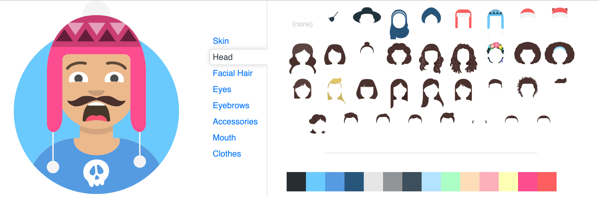

# avatars-customizer

Embeddable custom avatar generator



## Install

```bash
npm install @schoolhouse/avatars-customizer
# OR
yarn add @schoolhouse/avatars-customizer
```

React, react-dom, avatars, and lodash are peer dependencies.

## Usage

```jsx
import React from 'react'

import AvatarsCustomerizer from '@schoolhouse/avatars-customizer'

function Example() {
  const [customizedAttributes,setCustomizedAttributes] = React.useState({
    topType:'LongHairMiaWallace',
    accessoriesType:'Prescription02',
    hairColor:'BrownDark',
    facialHairType:'Blank',
    clotheType:'Hoodie',
    clotheColor:'PastelBlue',
    eyeType:'Happy',
    eyebrowType:'Default',
    mouthType:'Smile',
    skinColor:'Light',
  });

  return (
    <AvatarsCustomizer value={customizedAttributes} onChange={setCustomizedAttributes}/>
  )
}
```

## License

MIT © [cgross](https://github.com/cgross)
